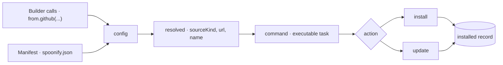
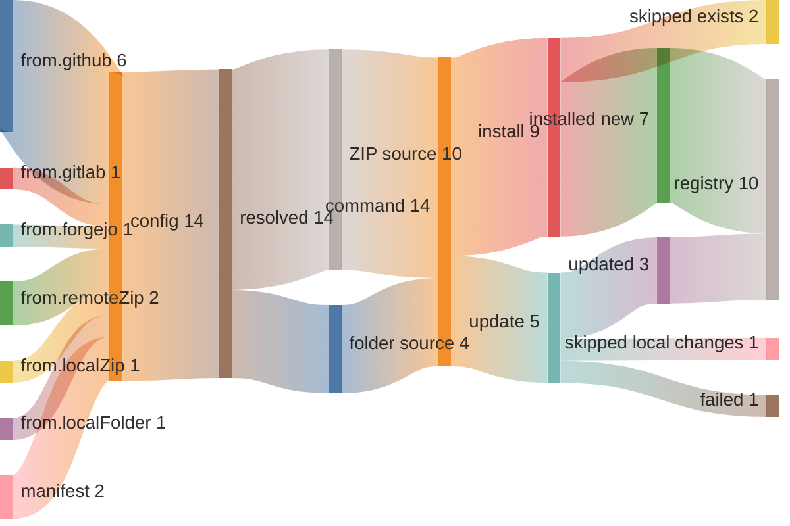
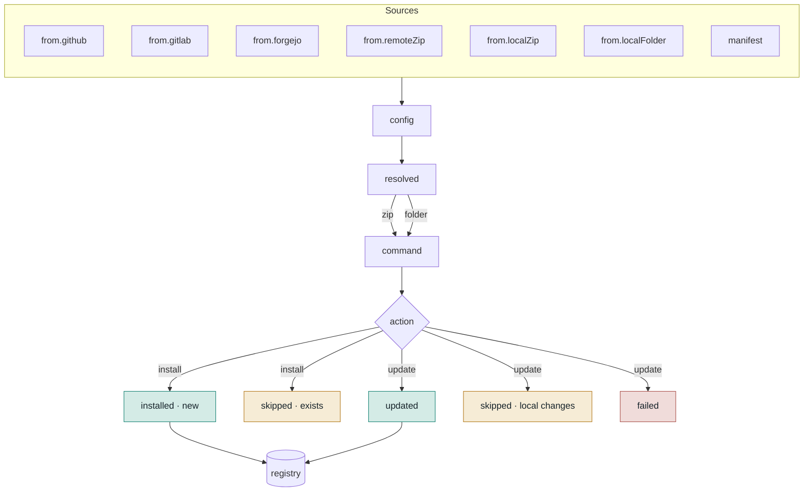
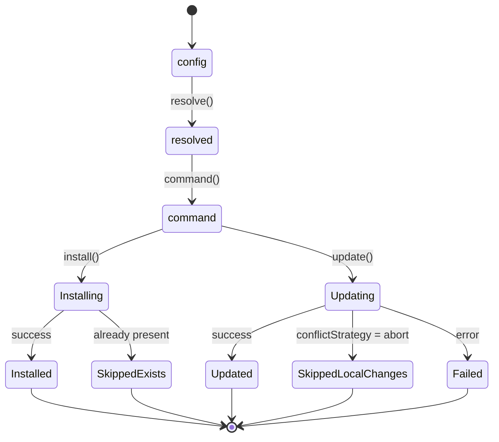
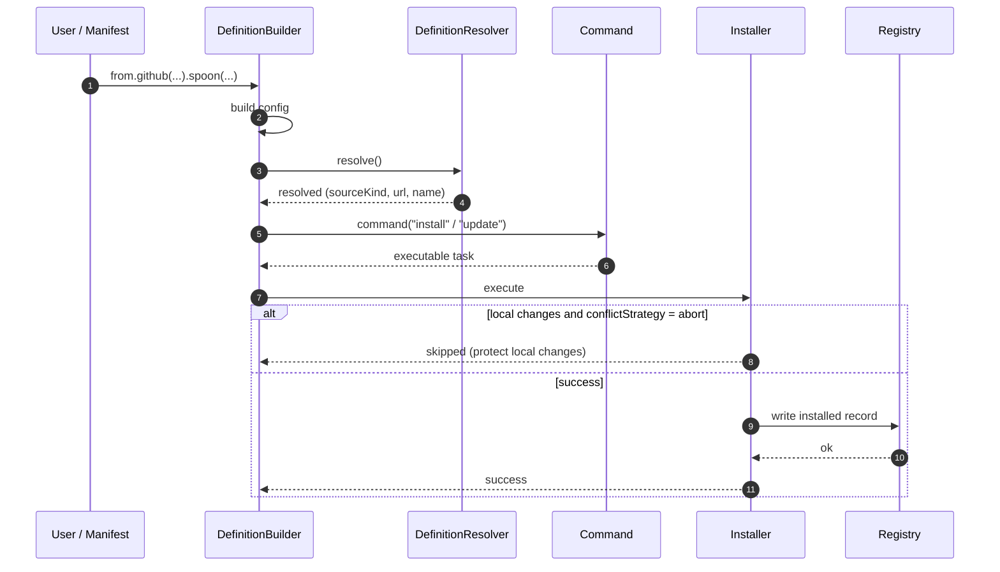

# Pipeline (Visual Reference)

A visual companion to `../completed/definition-resolution-command.md` and
`../completed/source-provider-pipeline.md`. It shows how a Spoon travels through
SpoonManager in several diagram forms. A rendered version is kept alongside this
file as `pipeline.html`.

## Rendering note

GitHub renders Mermaid in Markdown from ```mermaid code blocks. The flowchart,
grouped-flow, state, and sequence diagrams below render on GitHub. The Sankey
uses `sankey-beta`, which is newer and may not render depending on GitHub's
Mermaid version — the grouped flow is the reliable alternative there.

## 1. The canonical pipeline

Builder calls or a manifest produce a declarative `config`, enriched stage by
stage until it executes and writes an installed record.



## 2. Flows as a Sankey

Many source types funnel into one `config`, resolution splits into ZIP vs.
folder, and the action splits into install/update with their outcomes. The
widths are **schematic, not measured** — they show branching structure, not real
volumes.



## 3. Grouped flow (lanes)

The same flow grouped into Sources → Pipeline → Outcomes, with outcomes
colour-coded. The most readable "map", and it renders everywhere.



## 4. Lifecycle (state diagram)

The pipeline as a state machine — it makes the terminal outcomes explicit.



## 5. Component interaction (sequence)

The same journey as a conversation between components over time, including the
local-changes decision branch.



## Which form for the docs?

The grouped flow (3) works best as the primary map and the state diagram (4) for
the outcomes — both render everywhere. The Sankey (2) is the eye-catcher but
earns its keep only once real counts exist; the sequence (5) suits a "how it
works internally" page.
